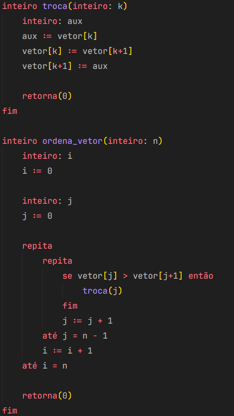

# Atividade: Highlight Syntax para a Linguagem TPP

Crie um Highlight Syntax para a Linguagem TPP, trabalhada na disciplina de Compiladores no seu editor favorito.

[Syntax Highlight Guide do VS Code](https://code.visualstudio.com/api/language-extensions/syntax-highlight-guide)

Deve ser entregue um pacote contendo o código fonte do plugin e instruções de instalação.

# Guia de alteração

Para alterar a extensão, entre na pasta `extension/syntaxes` e conterá um arquivo .tmLanguage.json. Nesse arquivo é possível editar a sintaxe da linguagem.

# Guia de build

Para buildar a extensão é necessário ter o pacote `npm i -g vsce` instalado. Entre na pasta `extension` e rode o comando `npm run pack`.

# Guia de instação

Após buildar a extensão, ela gerará um arquivo .vsix. No seu vscode, pressione `shift` + `control` + `p` e procure por Extensions: Install from VSIX. Após selecionar esta opção, carregue o arquivo .vsix e a extensão será instalada.

